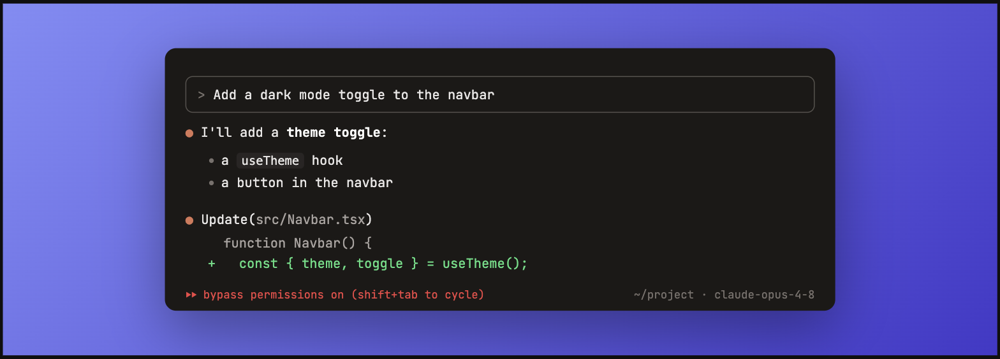

<div align="center">

# ⚛️ nitrogen

### Turn your Claude Code sessions into share-worthy images

**nitrogen** is [carbon.now.sh](https://carbon.now.sh) for AI coding — compose a faux
[Claude Code](https://claude.com/claude-code) terminal session from typed blocks and export
a crisp, social-ready PNG. Prompt boxes, `●` responses, tool calls, diffs, and the
permission-mode status bar — rendered exactly like the real thing.


</div>

---

## ✨ Features

- **Faithful Claude Code TUI** — the `>` prompt box, coral `●` assistant lines, `⎿` tool
  connectors, green/red diffs, rendered markdown, and the bottom status bar.
- **Structured block editor** — build a session from typed blocks: user prompt, assistant
  (markdown), and `Bash` / `Edit` (diff) / `Read` tool calls. Add, reorder, and delete.
- **Two independent windows** — compose an A/B comparison in one image: `single`,
  `split ↔` (left/right), or `split ↕` (top/bottom). Each window has its own blocks **and**
  its own permission mode / cwd / model.
- **Every permission mode** — `normal`, `⏵⏵ accept edits`, `⏵ plan mode`, and
  `⏵⏵ bypass permissions` (in red) — mirroring Claude Code exactly.
- **Beautiful framing** — gradient / solid / transparent backdrops, adjustable padding, and
  aspect presets (auto, 16:9, square, X/Twitter, LinkedIn).
- **2× PNG export** — one click renders the framed layout to a high-resolution PNG with the
  monospace font embedded.
- **Zero backend** — everything runs in your browser; your work auto-saves to `localStorage`.

## 🖼️ Example output

Two prompt variants side by side — the kind of comparison that reads great in a feed:


A single window on the indigo backdrop, in `bypass permissions` mode:



## 🚀 Getting started

```bash
npm install
npm run dev      # start the dev server at http://localhost:5173
```

Then:

1. Pick a **layout** (single or split) and a **backdrop**.
2. In the editor, **add blocks** to build your session — pick a role, type or paste text.
3. Set each window's **permission mode / cwd / model** (use the tabs in split layouts).
4. Hit **Export PNG** and share.

Other scripts:

```bash
npm run build    # type-check + production build
npm test         # run the test suite (Vitest)
npm run test:watch
```

## 🧱 How it works

Your session is a `Doc` — two independent `TerminalWindow`s plus a shared frame
(backdrop / padding / aspect / layout). A small store with pure reducers drives the state
and persists it to `localStorage`. The preview renders one or two `Terminal`s inside the
frame, and export captures that exact node with [`html-to-image`](https://github.com/bubkoo/html-to-image)
at 2× — so the PNG matches the preview pixel for pixel.

```
src/
  state/      # Doc / TerminalWindow / FrameSettings types, reducers, persistence, useDoc hook
  terminal/   # faux Claude Code TUI: theme, status bar, per-block renderers
  editor/     # left pane: frame controls, window tabs, per-window settings, block editors
  preview/    # backdrops + layout-aware preview (1 or 2 terminals)
  export/     # html-to-image 2× PNG export
  markdown/   # markdown renderer for assistant blocks
  Header.tsx  # the nitrogen brand bar
```

## 🛠️ Built with

- [React](https://react.dev) + [TypeScript](https://www.typescriptlang.org) (strict)
- [Vite](https://vite.dev) + [Tailwind CSS v4](https://tailwindcss.com)
- [Vitest](https://vitest.dev) + [Testing Library](https://testing-library.com)
- [html-to-image](https://github.com/bubkoo/html-to-image), [marked](https://marked.js.org),
  [JetBrains Mono](https://www.jetbrains.com/lp/mono/)

---

<div align="center">
<sub>Not affiliated with Anthropic. "Claude" and "Claude Code" are trademarks of Anthropic.</sub>
</div>
