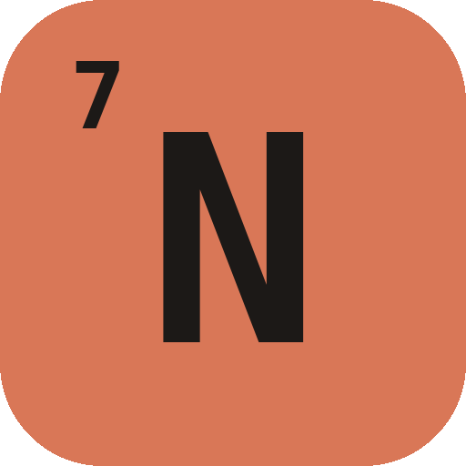
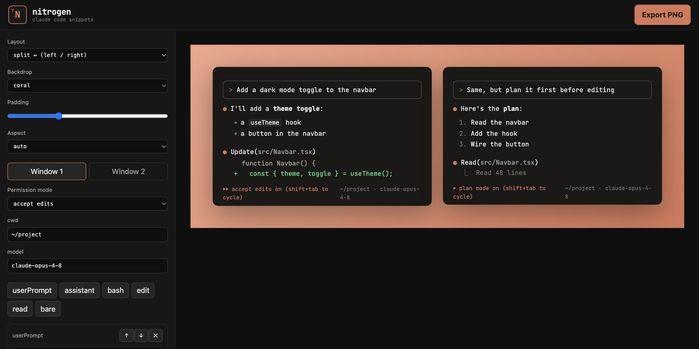
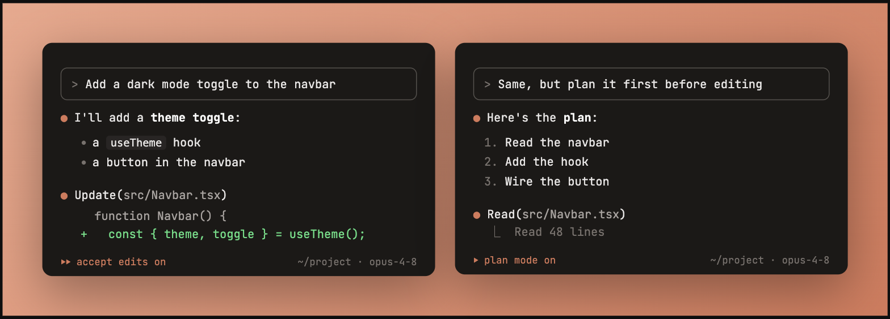
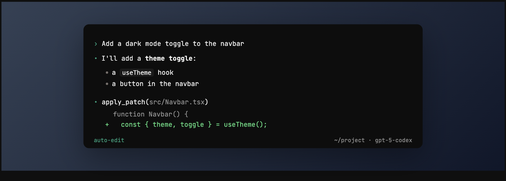

<div align="center">



# nitrogen

### Turn your coding-agent sessions into share-worthy images

[](https://github.com/choyiny/nitrogen/actions/workflows/ci.yml)

**🌐 Live at [nitrogen.cite-met.dev](https://nitrogen.cite-met.dev)**

**nitrogen** is [carbon.now.sh](https://carbon.now.sh) for AI coding — compose a faux
coding-agent terminal session from typed blocks and export a crisp, social-ready PNG. Prompt
boxes, `●` responses, tool calls, diffs, and the status bar — rendered in the style of
**Claude Code**, **Codex CLI**, or **Gemini CLI**.



</div>

---

## ✨ Features

- **Per-window agent themes** — render each window as **Claude Code** (coral `●`, `Bash`/`Update`),
  **Codex CLI** (teal `•`, plain `›` prompt, `apply_patch`), or **Gemini CLI** (blue `✦`,
  `Shell`/`ReadFile`) — colors, markers, tool labels, and status bar all match the agent.
- **Two independent windows** — put two agents side by side in one image: `single`,
  `split ↔` (left/right), or `split ↕` (top/bottom). Each window has its own blocks, agent,
  permission mode, cwd, and model.
- **Structured block editor** — build a session from typed blocks: user prompt, assistant
  (markdown), and Bash / Edit (diff) / Read tool calls. Add, reorder, and delete.
- **Permission-mode status bar** — `normal`, `accept edits`, `plan mode`, and `bypass
  permissions` (red), rendered per agent (Codex shows its approval terms, etc.).
- **Beautiful framing** — gradient / solid / transparent backdrops, adjustable padding, and
  aspect presets (auto, 16:9, square, X/Twitter, LinkedIn).
- **2× PNG export** — one click renders the framed layout to a high-resolution PNG with the
  monospace font embedded.
- **Zero backend** — everything runs in your browser; your work auto-saves to `localStorage`.

## 🖼️ Example output

Two agents on the same prompt, side by side — Claude Code vs Gemini CLI:



A single Codex CLI window on the slate backdrop:



## 🚀 Getting started

Just want to use it? It's hosted at **[nitrogen.cite-met.dev](https://nitrogen.cite-met.dev)**.

To run it locally:

```bash
npm install
npm run dev      # start the dev server at http://localhost:5173
```

Then:

1. Pick a **layout** (single or split) and a **backdrop**.
2. For each window, choose an **agent** and **add blocks** to build the session.
3. Set each window's **permission mode / cwd / model** (use the tabs in split layouts).
4. Hit **Export PNG** and share.

Other scripts:

```bash
npm run build    # type-check + production build
npm test         # run the test suite (Vitest)
npm run test:watch
```

## 🧱 How it works

Your session is a `Doc` — two independent `TerminalWindow`s (each with its own `agent`) plus
a shared frame (backdrop / padding / aspect / layout). A small store with pure reducers drives
the state and persists it to `localStorage`. Each window resolves an `AgentTheme` that controls
its colors, prompt, markers, tool labels, and status bar; the preview renders one or two
`Terminal`s inside the frame, and export captures that exact node with
[`html-to-image`](https://github.com/bubkoo/html-to-image) at 2× — so the PNG matches the
preview pixel for pixel.

```
src/
  state/      # Doc / TerminalWindow / FrameSettings types, reducers, persistence, useDoc hook
  themes/     # per-agent theme registry (Claude Code / Codex / Gemini) + theme context
  terminal/   # theme-driven TUI: status bar, per-block renderers
  editor/     # left pane: frame controls, window tabs, per-window settings, block editors
  preview/    # backdrops + layout-aware preview (1 or 2 terminals)
  export/     # html-to-image 2× PNG export
  markdown/   # markdown renderer for assistant blocks
  Header.tsx  # the nitrogen brand bar
```

## 🔗 Generate links from a coding agent

`skills/nitrogen-link/` is an [agent skill](https://github.com/vercel-labs/skills) that turns
a coding-agent session (or a description of one) into a ready-to-edit nitrogen link. The agent
drafts a concise summary as a `Doc`, and a bundled script (`encode.py`) compresses it into a
`https://nitrogen.cite-met.dev/#s=…` link you open and polish in the UI.

```bash
npx skills add choyiny/nitrogen@nitrogen-link
```

It's symlinked into `.claude/skills/` for local use in this repo. Trigger it with something like
"make a nitrogen link from this Claude Code session".

## 🛠️ Built with

- [React](https://react.dev) + [TypeScript](https://www.typescriptlang.org) (strict)
- [Vite](https://vite.dev) + [Tailwind CSS v4](https://tailwindcss.com)
- [Vitest](https://vitest.dev) + [Testing Library](https://testing-library.com)
- [html-to-image](https://github.com/bubkoo/html-to-image), [marked](https://marked.js.org),
  [JetBrains Mono](https://www.jetbrains.com/lp/mono/)

---

<div align="center">
<sub>Not affiliated with Anthropic, OpenAI, or Google. Claude Code, Codex, and Gemini are
trademarks of their respective owners.</sub>
</div>
